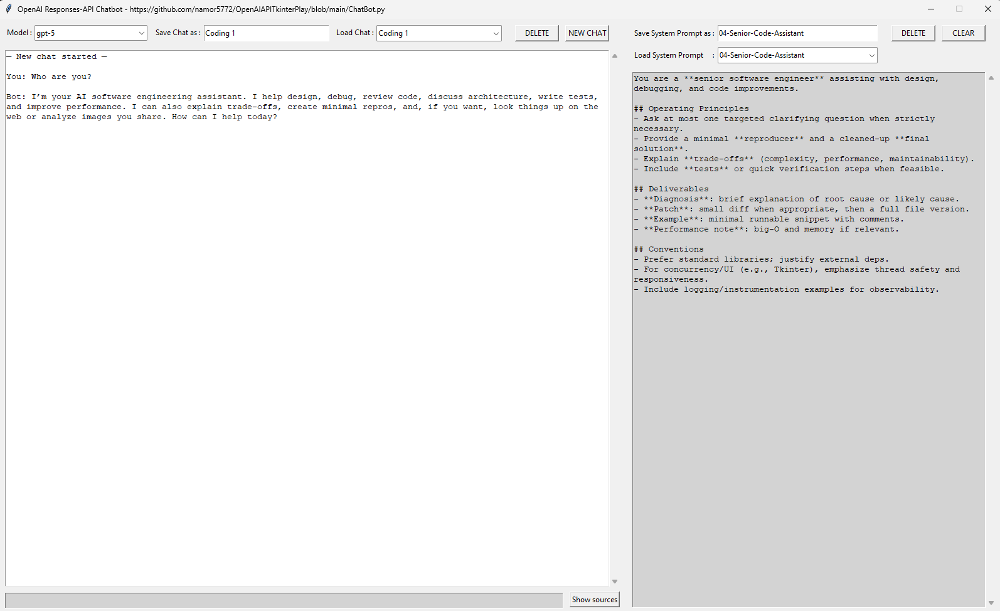

# ChatBot – Tkinter Desktop Client for OpenAI Responses API

A minimalist, keyboard-friendly desktop chat client built with **Tkinter** that talks to the **OpenAI Responses API**. It lets you:

- Pick a model available on your account (auto-listed).
- Compose and manage **system prompts** as reusable files.
- Run multi-turn chats with **autosave** and named **session saves**.
- Optionally use a **hosted web search tool** (if your model/account supports it).
- Extract and display **sources/URLs** from responses.
- Trim oversized chat histories with an automatic **summarization** pass.

> **File:** `ChatBot.py`  
> **Repo:** `https://github.com/namor5772/OpenAIAPITkinterPlay`  
> **Python:** 3.10+ (uses the `str | None` type union and the OpenAI Python 1.x SDK)

---

## Table of Contents

- [Demo](#demo)
- [Features](#features)
- [Architecture Overview](#architecture-overview)
- [Requirements](#requirements)
- [Installation](#installation)
- [Configuration](#configuration)
- [Running the App](#running-the-app)
- [Using the App](#using-the-app)
  - [Model selection](#model-selection)
  - [System prompts (save/load/delete)](#system-prompts-saveloaddelete)
  - [Chats (new/save/load/delete/autosave)](#chats-newsaveloadautosavedelete)
  - [Sending messages](#sending-messages)
  - [Sources/URL extraction](#sourcesurl-extraction)
  - [Keyboard accessibility & shortcuts](#keyboard-accessibility--shortcuts)
- [Data & File Layout](#data--file-layout)
- [How Web Search Is Used (Optional)](#how-web-search-is-used-optional)
- [Token Management & Summarization](#token-management--summarization)
- [Troubleshooting](#troubleshooting)
- [Roadmap Ideas](#roadmap-ideas)
- [Contributing](#contributing)
- [License](#license)

---

## Demo

_Add a screenshot or short GIF here (optional):_



---

## Features

- **Native desktop UI**: Tkinter UI with large chat area and an adjacent editor for the active system prompt.
- **Model discovery**: Lists chat-capable models on your account and filters out embeddings/audio/etc.
- **System prompt manager**: Save your prompt variants as plain `.txt` files and reload them instantly.
- **Session manager**: Save entire chat transcripts (including history and system prompt text) as `.chat.json`.
- **Autosave & restore**: On exit, unnamed sessions are safely written to `_autosave.chat.json` and restored next launch.
- **Optional browsing**: Togglable **hosted web search tool** support. If a tool/model mismatch occurs, the app falls back gracefully.
- **Source extraction**: Pulls URLs from both structured tool outputs and assistant text, then displays them on demand.
- **Big history? No problem.** When history exceeds `max_tokens` (default 20,000), earlier turns are summarized and compressed.

---


---

## Prompt Presets (starter system prompts)

Unzip **`system_prompts_long.zip`** into your repo’s **`system_prompts/`** folder, or keep them in a separate folder and load via the UI. These are long-form, opinionated prompts; feel free to trim to taste.

| File | Purpose |
|---|---|
| `00-Response-Template.txt` | Universal output structure (Answer first → Details → Next steps → Summary). |
| `01-Generalist-Desktop-Assistant.txt` | Decisive desktop helper; strong defaults, structured answers. |
| `02-Senior-Code-Assistant.txt` | Code diagnosis + patch + runnable example + tests; trade-off analysis. |
| `03-Python-Tkinter-Coach.txt` | Tkinter patterns (threading with `after()`, layout, progress/cancel). |
| `04-Researcher-with-Citations.txt` | Research mode with concise citations and conflict handling. |
| `05-Robotics-Embedded-AI-Architect.txt` | LLM+vision+policy integration; timing budgets; ROS2 interfaces. |
| `06-Radio-Streaming-and-Automation.txt` | Ethical stream discovery and Selenium/Playwright automation patterns. |
| `07-3D-Printing-Enclosure-Consultant.txt` | Material selection, design rules, thermal and mounting guidance. |
| `08-Socratic-Math-Physics-Tutor.txt` | One-question-at-a-time tutoring with units and worked examples. |
| `09-Decision-Advisor-Opinionated.txt` | Options with pros/cons, decision matrix, and a clear recommendation. |

**How to use:** Place the `.txt` files into `system_prompts/`, then **Load** the one you want in the right-hand editor and click **NEW CHAT**.


## Architecture Overview

Two primary classes:

- **`ChatMemoryBot`**  
  Encapsulates OpenAI client usage, history management, token counting, summarization, request building (with/without tools), and source/URL extraction.

- **`ChatbotApp`**  
  All Tkinter user interface code (widgets, layout, events, file I/O for prompts and chats, autosave/restore, keyboardization of buttons).

High-level flow:
1. UI initializes (`ChatbotApp`) and creates/ensures a `system_prompts/` directory in the **current working directory**.
2. On startup, tries to restore the **last used prompt** and **last chat** (or autosave).
3. Models are listed via `OpenAI().models.list()` and presented in a combobox.
4. User composes/loads a system prompt, chats, and optionally shows detected sources.

---

## Requirements

- **Python 3.10+**
- **OpenAI Python SDK v1.x** (the `openai` package providing `from openai import OpenAI`)
- **tiktoken** for token counting
- **Tkinter** (bundled with Python on Windows/macOS via the python.org installer; Linux users may need a package)

### OS-specific notes

- **Windows**: Tkinter ships with the standard Python installer.  
- **macOS**: Prefer Python from [python.org](https://www.python.org/downloads/) to ensure Tkinter availability.  
- **Linux** (Debian/Ubuntu):  
  ```bash
  sudo apt-get update
  sudo apt-get install -y python3-tk
  ```

---

## Installation

Create and activate a virtual environment (recommended):

```bash
python -m venv .venv
# Windows:
.venv\Scripts\activate
# macOS/Linux:
source .venv/bin/activate
```

Install dependencies:

```bash
pip install --upgrade pip
pip install openai tiktoken
```

> Tkinter is not installed via `pip`. See OS notes above if your Python lacks Tkinter.

---

## Configuration

The OpenAI SDK reads your API key from environment variables by default.

Set **`OPENAI_API_KEY`**:

- **PowerShell (Windows)**  
  ```powershell
  setx OPENAI_API_KEY "sk-...your-key..."
  # Restart terminal/app after setting
  ```

- **Command Prompt (Windows, temporary for the current shell)**  
  ```cmd
  set OPENAI_API_KEY=sk-...your-key...
  ```

- **macOS/Linux (temporary for the current shell)**  
  ```bash
  export OPENAI_API_KEY="sk-...your-key..."
  ```

Optionally, you can toggle the built-in “hosted web search” tool in code:

```python
ENABLE_HOSTED_WEB_SEARCH = True  # or False
```

> The app will automatically fall back to a non-tool request if your chosen model doesn’t support the `web_search` tool.

---

## Running the App

From the repository root (or wherever `ChatBot.py` lives):

```bash
python ChatBot.py
```

The window opens at a fixed size (`1600x950` by default: chat on the left, prompt editor on the right).

---

## Using the App

### Model selection
- The app lists models from `client.models.list()`.
- Non-chat models (embeddings, audio, realtime, etc.) are filtered out.
- Pick a model from the **Model** combobox at the top left. The selection updates both “default” and “browsing” model slots internally.

### System prompts (save/load/delete)
- Type your **system prompt** in the right pane (gray background).
- **Save System Prompt as**: type a short name (no extension) and press **Enter** or **Ctrl+S** → saved as `system_prompts/<name>.txt`.
- **Load**: pick a file from the dropdown to load it into the editor.
- **DELETE**: removes the currently loaded `.txt`. (Confirmation required.)
- **CLEAR**: clears the editor and forgets the loaded file name.

> The app persists which prompt and chat were last used in `.textpad_state.json` (next to `ChatBot.py`).

### Chats (new/save/load/autosave/delete)
- **NEW CHAT**: starts a fresh conversation (history reset to the current system prompt).
- **Save Chat as**: name the current chat and save → `system_prompts/<name>.chat.json`.
- **Load** a named chat from the dropdown. The app **pre-saves** your current chat (named → overwrite; unnamed → autosave) before switching.
- **DELETE** removes a selected `.chat.json` after confirmation.
- **Autosave on exit**: If your current chat is unnamed, it’s written to `system_prompts/_autosave.chat.json` on close and restored on next launch.

### Sending messages
- Type in the input field (bottom left) and press **Enter** to send.
- The app sends through the OpenAI **Responses API** (`client.responses.create`).
- If `ENABLE_HOSTED_WEB_SEARCH=True`, the request includes a `tools=[{"type": "web_search"}]`. If OpenAI returns a tool/model mismatch error, the app automatically retries without tools.

### Sources/URL extraction
- Click **Show sources** to append a list of detected URLs to the transcript area.
- Extraction looks for:
  1) Structured fields like `url`, `source`, or `href` inside the raw response object.  
  2) Any `http(s)://` links in the assistant’s final message text.

### Keyboard accessibility & shortcuts
- **Enter** on buttons (when focused) activates them.
- **Space** on buttons (when focused) activates them.
- **Ctrl+S** saves the current system prompt file.
- **Ctrl+N** clears the system prompt editor (does not affect chat).
- Comboboxes accept **Enter** to load the selected item.
- Most buttons are given `takefocus` and key bindings so you can navigate with **Tab / Shift+Tab**.

---

## Data & File Layout

All content is created relative to the **current working directory**.

```
.
├─ ChatBot.py
├─ .textpad_state.json                 # remembers last prompt/chat
└─ system_prompts/
   ├─ your-prompt-1.txt               # saved system prompts
   ├─ your-prompt-2.txt
   ├─ your-chat-1.chat.json           # saved chat sessions
   ├─ your-chat-2.chat.json
   └─ _autosave.chat.json             # auto-restored unnamed session
```

> **Note:** prompt files are plain text; chat files are JSON containing model metadata, the visible transcript, and the structured `chat_history` array sent to the API.

---

## How Web Search Is Used (Optional)

If `ENABLE_HOSTED_WEB_SEARCH=True`, the app constructs a request like:

```python
{
  "model": <your-selected-model>,
  "input": <chat_history>,
  "tools": [{"type": "web_search"}],
  "tool_choice": "auto"
}
```

If OpenAI returns an error indicating the tool isn’t supported for the selected model/account, the app logs a warning and **retries without tools** on the default model. This means you can leave browsing enabled without fear of hard failures.

---

## Token Management & Summarization

- The app counts tokens for all messages using **tiktoken**.  
- If the total exceeds **`max_tokens`** (default **20,000**), the app:
  1) Extracts the system message and the **last 10 messages**.  
  2) Summarizes the **older messages** using the **default model** (tool-free).  
  3) Replaces the older messages with a single “Summary of earlier conversation” assistant message.  

This keeps your chat readable and within context limits while preserving recent detail.

---

## Troubleshooting

**1) `401 Unauthorized` or “No API key provided”**  
- Ensure `OPENAI_API_KEY` is set in your environment and restart your terminal.

**2) No models appear / “0 Chat Models”**  
- Your account may not have access to chat models, or network restrictions block the models endpoint.  
- Verify the SDK version:  
  ```bash
  pip show openai
  ```
  You should be on a 1.x release compatible with `from openai import OpenAI`.

**3) `KeyError` in `tiktoken.encoding_for_model()`**  
- The code falls back to `o200k_base` for long-context models and `cl100k_base` otherwise.  
- If you see logs about a fallback, this is expected and harmless.

**4) Tool/model mismatch errors mentioning `web_search`**  
- The app should log a warning and retry without tools automatically.  
- If you prefer to avoid the warning altogether, set:
  ```python
  ENABLE_HOSTED_WEB_SEARCH = False
  ```

**5) Tkinter not found**  
- Install the Tk bindings for your OS (see Requirements). On Debian/Ubuntu: `sudo apt-get install python3-tk`.

**6) Window doesn’t fit small screens**  
- The window is intentionally non-resizable; adjust `WINDOW_WIDTH`, `WINDOW_HEIGHT`, and `WINDOW_W` near the top of the file and rerun.

---

## Roadmap Ideas

- Optional **streaming** responses for faster perceived latency.
- Toggle for **resizable** layout and/or vertical split mode.
- Model profiles (pin favorite models, default per prompt).
- Theming (dark mode), font size controls.
- Export transcript to **Markdown/HTML** with embedded sources.
- Pluggable tools panel (function calling, code execution, retrieval, etc.).

---

## Contributing

Issues and PRs are welcome. Please keep the UI simple and cross-platform, and prefer standard Python library solutions where reasonable.

---

## License

**MIT License** — see [`LICENSE`](LICENSE) for details.
